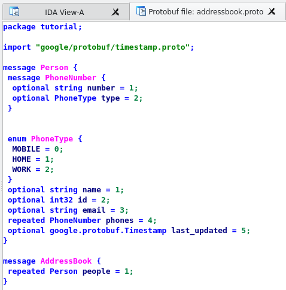

# Protobuf Finder
IDA plugin for reconstructing original `.proto` files from binary.

## Installation

1. Install Google protobuf python library - `$ pip install protobuf`
2. Copy protobuf.py into IDA plugins folder - `~/.idapro/plugins/`

## Usage

After loading the binary that contains Protocol Buffer specifications use `Search` > `Protobuf Finder`. This will spawn a custom view for each `.proto` file that was used to build the binary.



## Special Thanks
This IDA plugin is based on Protod - Protobuf's metadata extractor created by
Sysdream (<https://github.com/sysdream/Protod>). Original license below:

```
Copyright (c) 2012 SYSDREAM

Permission is hereby granted, free of charge, to any person obtaining a copy
of this software and associated documentation files (the "Software"), to deal
in the Software without restriction, including without limitation the rights
to use, copy, modify, merge, publish, distribute, sublicense, and/or sell
copies of the Software, and to permit persons to whom the Software is furnished
to do so, subject to the following conditions:

The above copyright notice and this permission notice shall be included in all
copies or substantial portions of the Software.

THE SOFTWARE IS PROVIDED "AS IS", WITHOUT WARRANTY OF ANY KIND, EXPRESS OR IMPLIED,
INCLUDING BUT NOT LIMITED TO THE WARRANTIES OF MERCHANTABILITY, FITNESS FOR A
PARTICULAR PURPOSE AND NONINFRINGEMENT. IN NO EVENT SHALL THE AUTHORS OR COPYRIGHT
HOLDERS BE LIABLE FOR ANY CLAIM, DAMAGES OR OTHER LIABILITY, WHETHER IN AN ACTION OF
CONTRACT, TORT OR OTHERWISE, ARISING FROM, OUT OF OR IN CONNECTION WITH THE SOFTWARE
OR THE USE OR OTHER DEALINGS IN THE SOFTWARE.

Author: Damien Cauquil <d.cauquil@sysdream.com>
```
